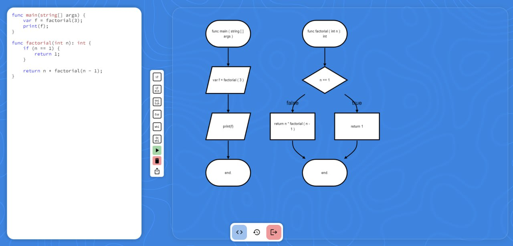

# CTOG

## Flowchart generator web-service


## How it works
Web-service is an SPA that takes source code in 
**custom written** language as an input:
```
fun factorial(int n): int {
    return n * factorial(n - 1);
}
```
Parses it using ANTLR library and then outputs a
flowchart for the program.
