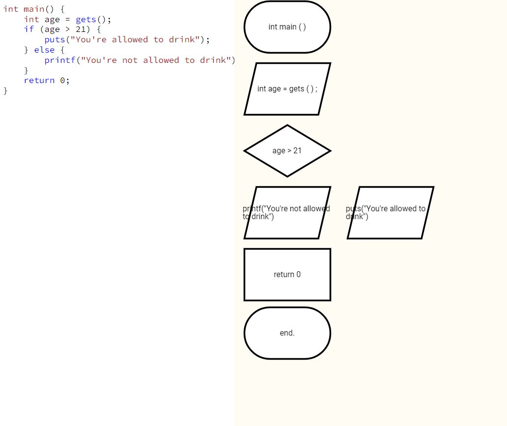

# Changes
## Changelist
- Changed default input/output function names
- Moved frontend project to angular
- Added first version of code editor and graph previewer
## TODO
- Design
- Add arrows
- More complex logic on graph nodes order (?)
- More complex logic to handle edge cases (??)
## Example
