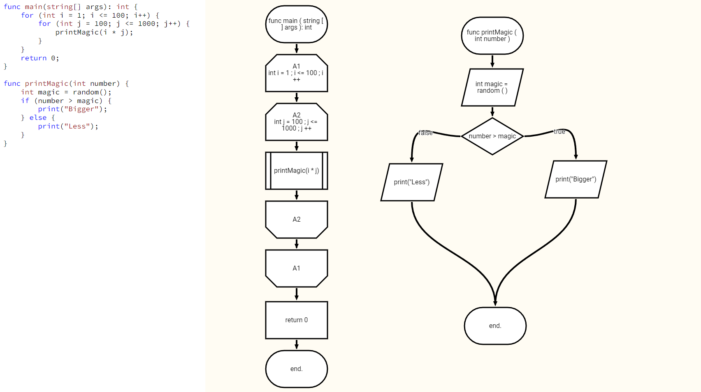
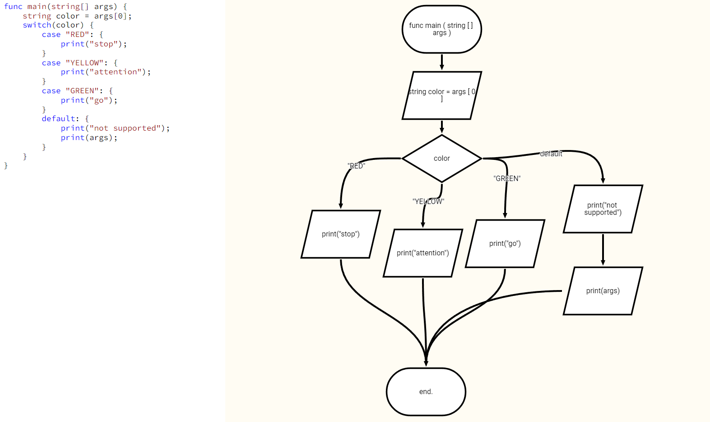

# New language support

## Changes
- Changed parsing rules
- Added exception handling
- Reworked node order implementation
- Bug fixes

## About new language
This project's goal is to create a tool for demonstrating purposes,
e.g. algorithm demo, new feature brain storm. Using graphical functionality of this software some abstraction level of the algorithm may be increased thus making it easier to understand.

In the same manner the chosen language supposed to be as user friendly as possible, which, imo, C doesn't correspond too well. Therefore a new language's syntax first version was developed, taking into account the main goal - readabilty.

### What's new?
- `func` keyword at the start of each function
- `curly braces` are now <b>necessary</b>
- `void` type is now <b>not required</b> to be specified 
- added supported for custom `types`
- other small improvements

### Code example
Old:
```c
int main(char** args) {
    printf(args[0]);
    if (args) return 0;
    else return 1;
}
```

New:
``` go
func main(string[] args): int {
    print(args[0]);
    if (args) {
        return 0;
    } else {
        return 1;
    }
}
```

## More examples (with screenshots)

### Nested loops


### New switch-case
